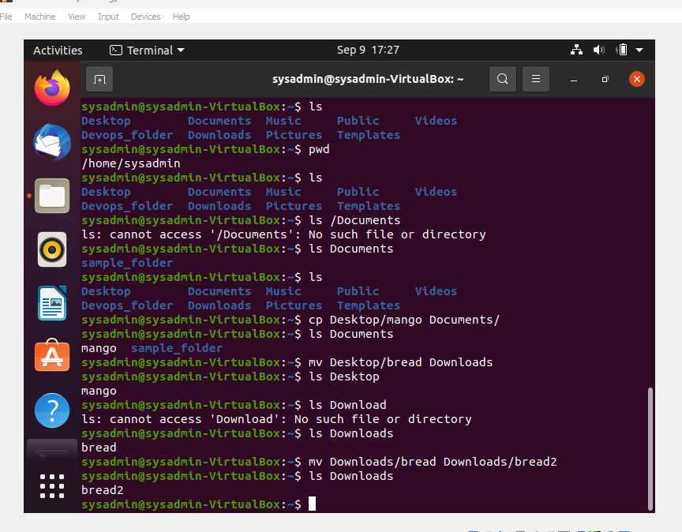

# sudo command

`sudo apt upgrade`

# pwd command

`pwd`

This command is used to print the current working directory

# cd command

`cd`

This command is to change directory

# ls command

This command is used to list the content of a directory

The ls command can also be run with options to format the way the listed contents are displayed

# cat command

`cat`

This command is used to display the content of a text file.

It can also be used to combine the content of two text files together. See command below

# cp command

`cp`

This command is used to copy files or directories from one location to another

# mv command

`mv`

This command is used to move files or directories from one location to another. It can also be used to rename a file or folder

# mkdir command

`mkdir`

To create directories

# rmdir command

To remove directories

# rm command

Command to remove files

# touch command

The touch command is used to crreate a text file

# locate command

# find command

# grep command

# df command

# du command

# head command

# tail command

# diff command

# tar command

# FILE PERMISSIONS AND OWNERSHIP

# chmod command

# chown command

# jobs command

# kill command

# ping command

# wget command

# uname command

# top command

# history command

# man command

# echo command

# zip, unzip commands

`zip`

This command is used to compress files

`unzip`

This is used to unzip

# hostname command

# useradd, userdel commands

# apt-get command

# nano, vi, jed commands

# alias, unalias commands

# su command

# htop command

# ps command